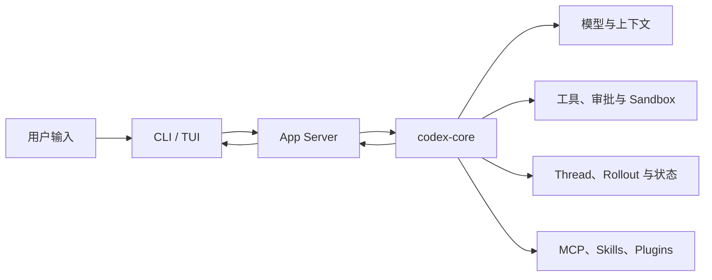

# learn-codex

面向开发者和 Agent 学习者的 Codex CLI 学习研究项目。

这里不复刻 Codex，而是从一次真实 Agent turn 出发，解释生产级 Agent Harness 如何连接 `CLI`、`TUI`、App Server、核心运行时、模型、工具、审批和持久化。内容特别关注可迁移到科研智能体的 Harness 设计。

## 从这里开始

1. [学习路线与阅读约定](docs/README.md)
2. [01：整体架构与运行边界](docs/01-architecture/README.md)
3. [02：一次 Agent Turn 的真实调用链](docs/02-agent-turn/README.md)



默认交互式 TUI 通过 App Server 与核心会话交互；TUI 并不直接调用 `codex-core`。这条路径是当前第一期内容的主线。

## 固定研究基线

第一期只研究 OpenAI 官方仓库 [`openai/codex`](https://github.com/openai/codex) 的固定版本：

| 项目 | 值 |
| --- | --- |
| 发布版本 | `0.145.0` |
| Git tag | `rust-v0.145.0` |
| 固定提交 | `25af12f7e61572b0bc18ddb1008be543b91519b0` |
| 上游许可证 | Apache-2.0 |

上游源码快照与本项目分离保存，不作为 vendor 代码提交。需要研究新版本时，先建立新的固定基线，再记录版本差异；不同版本的结论不能混用。

## 证据约定

- **上游事实**：必须能定位到该固定版本的源码、测试或官方文档，并记录仓库、tag/commit、文件路径与符号。
- **学习归纳**：为了帮助阅读而做的模块分组或解释，会明确标为归纳，不伪装成官方分层。
- **Harness 启发**：面向科研智能体的设计推断，和 Codex 的已证实行为分开书写。
- **待验证**：没有足够证据的内容保留问题，不用经验补全。

## 章节路线

| 章节 | 主题 | 状态 |
| --- | --- | --- |
| 01 | 整体架构与运行边界 | 已整理 |
| 02 | 一次 Agent Turn 的真实调用链 | 已整理 |
| 03 | Prompt、上下文与历史组装 | 计划中 |
| 04 | 工具、审批、Sandbox 与工作区边界 | 计划中 |
| 05 | Session、压缩、Rollout 与持久化 | 计划中 |
| 06 | App Server 与 JSON-RPC | 计划中 |
| 07 | MCP、Skills、Plugins 与 Subagent | 计划中 |
| 08 | 测试、评测与版本演进 | 计划中 |

## 核验基线

```powershell
$codexUpstream = "<本地 Codex 源码快照目录>"
git -C $codexUpstream rev-parse HEAD
git -C $codexUpstream describe --tags --exact-match
```
