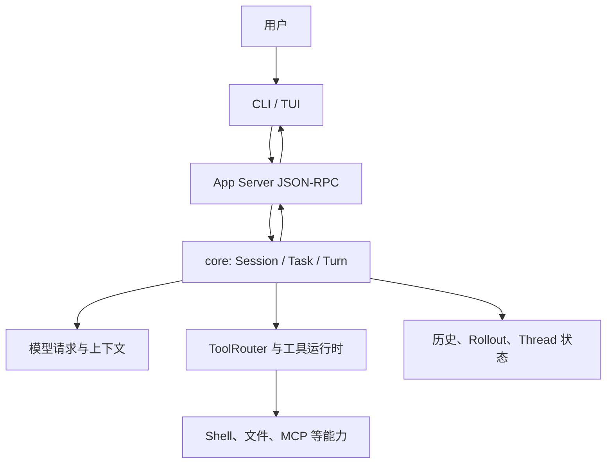

# 01：整体架构与运行边界

> 研究基线：OpenAI Codex `rust-v0.145.0`
>
> 固定提交：`25af12f7e61572b0bc18ddb1008be543b91519b0`

## 这一章回答什么

1. Codex 的源码为什么看起来像一个大 workspace？
2. 哪些模块负责界面、协议、核心执行、工具和状态？
3. 默认交互式使用时，哪些边界是理解一次 turn 的必经之路？

本章建立阅读地图，不逐行解释所有 crate。下一章再沿着一条真实输入追踪具体调用链。

## 先给结论

`codex-rs` 是一个包含大量 crate 的 Rust workspace。为了学习而不是迷失在目录中，可以把它归纳为七组职责：

| 学习分组 | 主要职责 | 代表模块 |
| --- | --- | --- |
| 命令与界面 | 接收用户操作、渲染终端交互 | `cli`、`tui` |
| App Server 与协议 | 用 JSON-RPC 连接客户端和核心会话，翻译事件 | `app-server`、`app-server-protocol`、`app-server-transport` |
| 核心 Agent Runtime | 管理 thread、turn、模型生成请求、任务和会话状态 | `core` |
| 模型与配置 | 解析配置、选择模型与提供方、发起模型请求 | `config`、`model-provider`、`codex-api` |
| 工具与执行边界 | 调度工具、执行命令、处理审批和 Sandbox | `core/src/tools`、`exec`、`execpolicy`、`sandboxing`、`apply-patch` |
| 扩展能力 | 接入 MCP、Skills、Plugins、Connectors 和扩展 API | `codex-mcp`、`skills`、`core-skills`、`core-plugins`、`connectors`、`ext` |
| 状态与可观测性 | 保存 thread、rollout、记忆和追踪数据 | `thread-store`、`rollout`、`rollout-trace`、`memories`、`otel` |

这是本项目的**学习归纳**，不是上游声明的唯一官方分层。

## 默认交互路径

这里最重要的边界是：**默认交互式 TUI 经由 App Server 与核心会话交互。**

因此，不应把它概括为“TUI 直接调用 `codex-core`”。

上图只描述当前研究主线，不表示所有 CLI 子命令、IDE 客户端或云端工作流都经过完全相同的路径。

## 为什么先读这七组

- `core` 是行为中心：它拥有 Session、Turn、任务和工具循环。
- `app-server` 是交互边界：它接收 `turn/start`、`turn/steer` 等请求，并把核心事件翻译成客户端通知。
- `tui` 是本地交互边界：它决定用户输入是启动新 turn，还是注入正在运行的 turn。
- 工具、审批和 Sandbox 不应被当成一个黑盒；它们决定 Agent 可以做什么、何时需要人确认、执行发生在哪里。
- 持久化和 rollout 不是附属功能。它们决定会话怎样恢复、轨迹怎样被复核。

## 源码证据

所有定位均相对于固定上游版本的仓库根目录。

| 结论 | 文件与符号 | 证据说明 |
| --- | --- | --- |
| Rust workspace 包含核心、TUI、App Server、MCP、工具和持久化等大量 crate | `codex-rs/Cargo.toml` 的 `[workspace].members` | workspace 成员表列出这些模块 |
| TUI 有独立的 App Server 会话封装 | `codex-rs/tui/src/app_server_session.rs` 的 `AppServerSession` | TUI 通过它发出类型化请求 |
| TUI 把用户输入路由为 `turn/start` 或 `turn/steer` | `codex-rs/tui/src/app/thread_routing.rs` 的 `AppCommand::UserTurn` | 是否存在活动 turn 决定分支 |
| App Server 持续消费核心事件 | `codex-rs/app-server/src/request_processors/thread_lifecycle.rs` 的 `conversation.next_event()` | 核心事件在这里进入协议层 |
| 核心运行时管理 turn 任务 | `codex-rs/core/src/session/handlers.rs` 的 `user_input_or_turn_inner`；`codex-rs/core/src/tasks/regular.rs` 的 `RegularTask` | 新输入会启动或注入任务 |
| 工具调度归属核心运行时 | `codex-rs/core/src/session/turn.rs` 的 `run_sampling_request`；`codex-rs/core/src/tools/parallel.rs` 的 `ToolCallRuntime` | 工具由模型输出触发并由核心调度 |

## 这一章暂不深入的内容

下面这些模块很重要，但不是理解第一条 turn 主链的起点：

- 登录、模型目录、发布和平台适配。
- 指标、反馈、遥测的所有实现细节。
- 云端任务与外部 Agent 迁移。
- 每一种 MCP、Plugin 或 Connector 的具体协议。

后续章节会在主链已经建立后逐步展开它们。

## 对其他 Agent Harness 的启发

### 已证实事实

- Codex 将界面、协议、核心执行、工具边界和状态保存拆在不同 crate 与模块中。
- 默认 TUI 与核心会话之间存在 App Server 协议层。

### 设计推断

- 其他 Agent 即使初期只有一个 CLI，也值得提前区分“界面接入”和“核心运行时”。这会为 IDE、批处理或 Web 客户端留出接入空间。
- 工具执行、审批策略、工作区权限和会话持久化应有清楚边界，而不是散落在单一 Agent loop 中。

### 待验证问题

- 非交互 CLI 子命令与 TUI 是否共用全部运行时路径？
- IDE 等其他客户端使用 App Server 时，与 TUI 的差异在哪里？

## 下一章

继续阅读 [02：一次 Agent Turn 的真实调用链](../02-agent-turn/README.md)，从用户输入开始，追踪新 turn、steer、模型生成请求、工具输出和事件回传。
