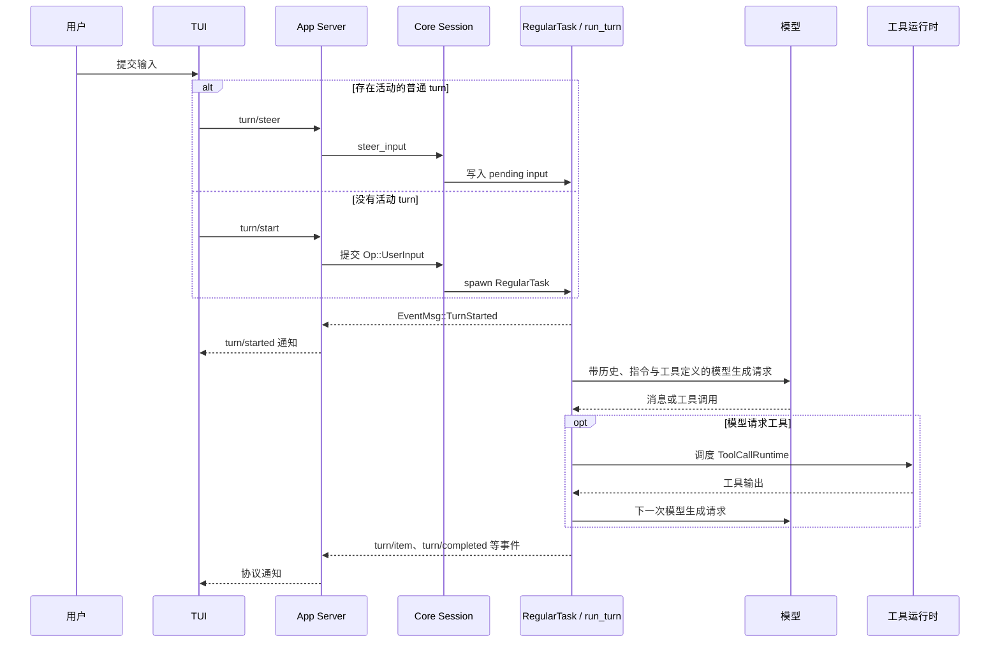

# 02：一次 Agent Turn 的真实调用链

> 研究基线：OpenAI Codex `rust-v0.145.0`
>
> 固定提交：`25af12f7e61572b0bc18ddb1008be543b91519b0`

## 5 轮 Agent Loop 互动回放

<iframe
  src="./agent-loop-lab/"
  title="5 轮 Agent Loop 互动回放"
  loading="eager"
  style="display:block;width:100%;height:920px;border:1px solid #d0d7de;border-radius:8px;"
></iframe>

[在独立页面打开互动回放](./agent-loop-lab/)

这一页刻意只保留 `History -> 请求模型生成 -> 工具调用 -> 结果写回 History` 的循环；前 4 轮展示工具调用如何让历史累加，第 5 轮展示模型在拥有足够上下文后给出最终回复并结束当前 turn。

互动回放使用预设教学数据，不调用真实模型或工具，也不是某次真实会话的逐项日志；循环机制和源码定位仍以本章固定上游基线为准。GitHub 的 Markdown 文件浏览页不会执行页面脚本，请通过 GitHub Pages 教程查看嵌入版本。

## 问题

用户在交互式 Codex 中提交一条消息后：

1. 它怎样成为一个 turn？
2. 正在运行时继续输入，为什么有时不是新 turn？
3. 模型调用工具后，工具结果怎样回到下一次模型生成请求？
4. TUI 怎样知道 turn 已开始、工具正在执行或 turn 已结束？

本章只追踪默认交互式 TUI 路径。它不覆盖所有 CLI 子命令、IDE 客户端和云端工作流。

## 一张真实调用图



## 新 Turn 与 Steer

### TUI 的第一层判断

`AppCommand::UserTurn` 会先查询当前 thread 是否有活动 turn：

| 条件 | TUI 请求 | 后果 |
| --- | --- | --- |
| 没有活动 turn | `turn/start` | App Server 提交新的用户输入操作 |
| 有活动的普通 turn | `turn/steer` | 输入写入活动 turn 的 pending input |
| 有活动的 review 或 compact turn | `turn/steer` 被拒绝 | TUI 按自身队列和重试逻辑处理 |

这说明“运行中继续发消息”在语义上是对当前工作单元的 steering，不等同于无条件创建一个新 turn。

### Core 的并发保护

`turn/start` 到达核心后，`user_input_or_turn_inner` 仍会先尝试 `steer_input`。若此时确实不存在活动任务，才创建 `RegularTask`。这是对客户端观察到的活动状态与核心实际状态之间竞态的保护，而不是对 TUI 决策的重复实现。

## 运行轨迹

### 1. 输入进入 App Server

`AppServerSession::turn_start` 将 TUI 输入编码为 `ClientRequest::TurnStart`。App Server 的 `turn_start_inner` 完成输入限制、工作区与权限覆盖处理后，构造 `Op::UserInput`，再调用 `submit_user_input_with_client_user_message_id`。

返回给客户端的 `turn.id` 是核心提交队列生成的 submission id。

### 2. Core 启动或注入任务

核心 Session 的 submission loop 将 `Op::UserInput` 交给 `user_input_or_turn_inner`：

- 若能 steer：把用户输入和附加上下文追加到活动 turn 的 pending input。
- 若没有活动 turn：构造 `TurnInput`，调用 `spawn_task`，启动 `RegularTask`。

`RegularTask` 先发出 `EventMsg::TurnStarted`，然后反复调用 `run_turn`；只要活动 turn 仍有 pending input，就会开始下一轮 `run_turn`。

### 3. 组装一次模型生成请求

`run_turn` 会完成以下准备：

1. 更新上下文和参考上下文项。
2. 注入 Skills 与 Plugins 产生的内容。
3. 记录用户输入及 hook 产生的输入。
4. 捕获当前 step 的工具、配置和环境视图。
5. 从历史构建本次模型生成请求的输入。

之后 `run_sampling_request`（源码命名；本文称“模型生成请求”）生成工具路由器和 `ToolCallRuntime`，通过 `ModelClientSession::stream` 消费模型响应流。

### 4. 模型消息与工具调用分叉

模型响应项完成时，`handle_output_item_done` 会尝试将其解析为工具调用：

| 模型输出 | 核心处理 | 是否需要再次请求模型生成 |
| --- | --- | --- |
| 普通消息或推理项 | 转为 turn item、发出完成事件、写入历史 | 通常不需要 |
| 工具调用 | 立即记录调用项，创建 `ToolCallRuntime` future | 需要 |
| 可直接回复模型的工具错误 | 将错误写为函数调用输出 | 需要 |
| 致命工具错误 | 中断当前路径 | 不继续 |

工具 future 会先进入 `FuturesOrdered` 队列。模型响应流结束后，核心通过 `drain_in_flight` 等待这些 future，并把工具输出写入会话历史。当前 `run_turn` 会从更新后的历史重新构建提示词，并再次请求模型生成，因此模型能看到工具结果。

`needs_follow_up` 不只表示“有工具调用”：工具调用、待处理用户输入，以及模型返回 `end_turn = false` 等情况都会让 turn 继续。

### 5. 事件回到 TUI

App Server 的 thread lifecycle 循环调用 `conversation.next_event()` 获取核心事件。`apply_bespoke_event_handling` 将例如 `EventMsg::TurnStarted` 的核心事件转换为 `ServerNotification::TurnStarted`。

TUI 收到通知后，先按 thread 路由，再交给 `ChatWidget::handle_server_notification` 更新界面。

## 源码定位

所有路径均相对于固定上游仓库根目录。

| 断点 | 文件与符号 |
| --- | --- |
| TUI 判断 `turn/start` 或 `turn/steer` | `codex-rs/tui/src/app/thread_routing.rs`，`AppCommand::UserTurn` |
| TUI 发起 `turn/start` | `codex-rs/tui/src/app_server_session.rs`，`AppServerSession::turn_start` |
| App Server 处理启动请求 | `codex-rs/app-server/src/request_processors/turn_processor.rs`，`turn_start_inner` |
| Core 提交用户输入 | `codex-rs/core/src/codex_thread.rs`，`submit_user_input_with_client_user_message_id`；`codex-rs/core/src/session/mod.rs`，`submit_user_input_with_client_user_message_id` |
| 启动或 steer 任务 | `codex-rs/core/src/session/handlers.rs`，`user_input_or_turn_inner`；`codex-rs/core/src/session/mod.rs`，`steer_input` |
| 普通 turn 任务 | `codex-rs/core/src/tasks/regular.rs`，`RegularTask::run` |
| turn 和模型生成循环 | `codex-rs/core/src/session/turn.rs`，`run_turn`、`run_sampling_request`、`try_run_sampling_request` |
| 工具项处理 | `codex-rs/core/src/stream_events_utils.rs`，`handle_output_item_done` |
| 工具运行与并行闸门 | `codex-rs/core/src/tools/parallel.rs`，`ToolCallRuntime::handle_tool_call_with_source` |
| App Server 消费并翻译事件 | `codex-rs/app-server/src/request_processors/thread_lifecycle.rs`；`codex-rs/app-server/src/bespoke_event_handling.rs` |
| TUI 消费通知 | `codex-rs/tui/src/app/app_server_events.rs`；`codex-rs/tui/src/app/thread_routing.rs` |

## 测试证据

| 要验证的行为 | 上游测试 |
| --- | --- |
| `turn/start` JSON-RPC 请求与 core user-input span 的关系 | `codex-rs/app-server/src/message_processor_tracing_tests.rs`，`turn_start_jsonrpc_span_parents_core_turn_spans` |
| 无活动 turn 时不能 steer | `codex-rs/core/src/session/tests.rs`，`steer_input_requires_active_turn` |
| steer 必须匹配预期 turn id | `codex-rs/core/src/session/tests.rs`，`steer_input_enforces_expected_turn_id` |
| review、compact turn 不可 steer | `codex-rs/core/src/session/tests.rs`，`steer_input_rejects_non_regular_turns` |
| 成功 steer 返回活动 turn id | `codex-rs/core/src/session/tests.rs`，`steer_input_returns_active_turn_id` |

## 最小验证

### 静态复核

```powershell
$codexUpstream = "<本地 Codex 源码快照目录>"

rg -n "AppCommand::UserTurn|turn_steer|turn_start" `
  (Join-Path $codexUpstream "codex-rs/tui/src/app/thread_routing.rs")

rg -n "turn_start_inner|submit_user_input_with_client_user_message_id" `
  (Join-Path $codexUpstream "codex-rs/app-server/src/request_processors/turn_processor.rs")

rg -n "user_input_or_turn_inner|steer_input|run_turn|run_sampling_request" `
  (Join-Path $codexUpstream "codex-rs/core/src/session/handlers.rs") `
  (Join-Path $codexUpstream "codex-rs/core/src/session/mod.rs") `
  (Join-Path $codexUpstream "codex-rs/core/src/session/turn.rs")
```

### 上游测试

在安装了 Rust 工具链的环境中，可从 `codex-rs` 目录运行：

```powershell
cargo test -p codex-core steer_input --lib
cargo test -p codex-app-server turn_start_jsonrpc_span_parents_core_turn_spans --lib
```

本项目当前环境未安装 `cargo`，因此本轮只静态核对了测试源码，未宣称这些测试已在本机执行通过。

## 对其他 Agent Harness 的启发

### 已证实事实

- 用户输入与核心事件之间有明确的协议边界。
- 一个活动 turn 可以接收 steering 输入，而不是只能被中断或等待结束。
- 工具输出会进入会话历史，并成为下一次模型生成请求的可见上下文。
- 支持并行的工具与不支持并行的工具使用不同的执行闸门。

### 设计推断

- 长任务中的补充条件、范围调整或输入修正，可以设计为 steer，而不必粗暴地取消整个任务。
- 工具调用、工具结果、用户修正和模型生成请求应形成可回放的事件链，便于复核实验决策。
- 对可能改变实验环境的工具，审批和工作区边界应在工具运行时附近实施，而不是只依赖提示词约束。

### 待验证问题

- 不同类型工具的并发能力怎样声明，并如何影响工具结果写回次序？
- 上游对中断、审批等待与 steering 同时发生时有哪些完整保证？
- App Server 的历史重放与实时事件在客户端状态一致性上如何协作？
